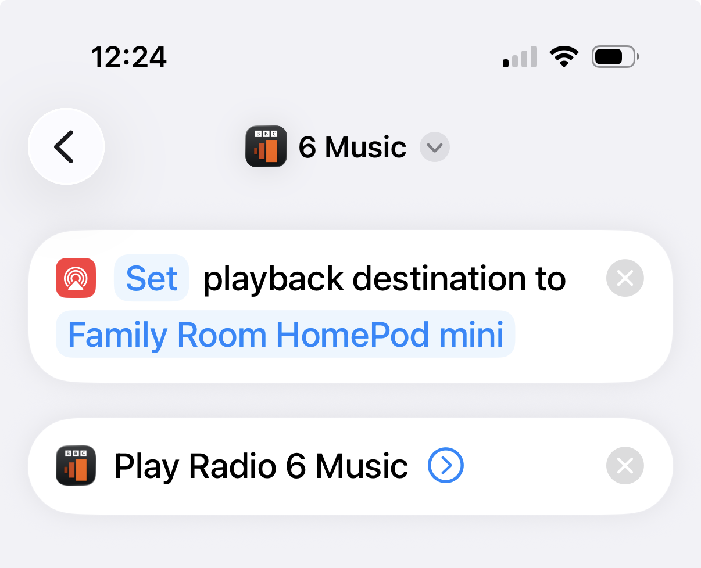

This may be a fairly niche topic for those in the UK, but it’s a hack I now use daily so I thought I’d share.

Unlike many other radio stations, it’s not possible to ask your Apple HomePod to directly play radio from the BBC. If I say, “Play 6 Music”, my HomePod mini starts playing the soundtrack to “Six: The Musical”. The BBC has locked away the feeds behind their [Sounds app](https://apps.apple.com/gb/app/bbc-sounds/id1380676511). You can AirPlay stations from the Sounds app on your iPhone, but this requires multiple taps each time you want to listen.

Instead, I’ve created a simple Shortcut on my iPhone for each radio station that automates the process. The secret is to first change the playback destination to be your HomePod so that the audio isn’t played from your iPhone.

Using this shortcut, and similar ones I’ve created for Radio 4, 5 Live, and the new [Indie Forever](https://www.bbc.co.uk/sounds/play/live/bbc_radio_six_indie_forever), I can simply ask my HomePod mini to “Run 6 Music”.

Note: I’ve found that the verb you say needs to be “run” instead of “play” for the shortcut to execute.

It would be cleaner if the BBC would relent and allow you to directly play stations, but I’m assuming they would lose all the lovely data from the Sounds app. For now, this is a nice quality of life improvement that I hope helps British radio listeners with Apple devices.
