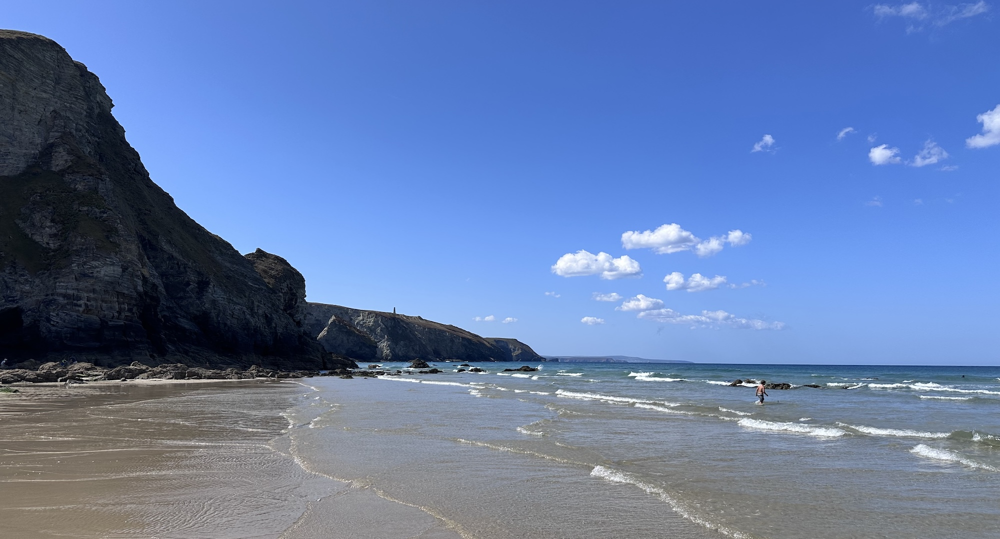

I’ve been away on holiday, so sorry if these weeknotes are a little late. I was a little busy holidaying.

We were in [Porthtowan](https://www.visitcornwall.com/things-to-do/beaches/porthtowan-beach), a little town on the north coast of Cornwall, staying in a cottage right by the beach with my parents.

I squeezed myself into a wetsuit and surprised myself enjoying [bodyboarding](https://en.wikipedia.org/wiki/Bodyboarding). The boys built sandcastles and explored the caves. We played cricket and football on the sand. And we ate hot [pasties](https://en.wikipedia.org/wiki/Pasty) from the local shop. Perfect. More on our holiday next time.

The Premier League is back. Arsenal opened the season and [continued](https://www.bbc.co.uk/sport/football/live/cmy0jjenxx24t) their good form at home to Coventry. And [FPL](https://fantasy.premierleague.com/en/) is also back. H is already obsessed.

One nice bit of site news: my [work page](https://barryfrost.com/work) is [featured](https://docs.sifa.id/docs/lexicons-and-integrations#personal-sites-driven-by-a-sifa-profile) on [Sifa](https://sifa.id)’s integrations page.
