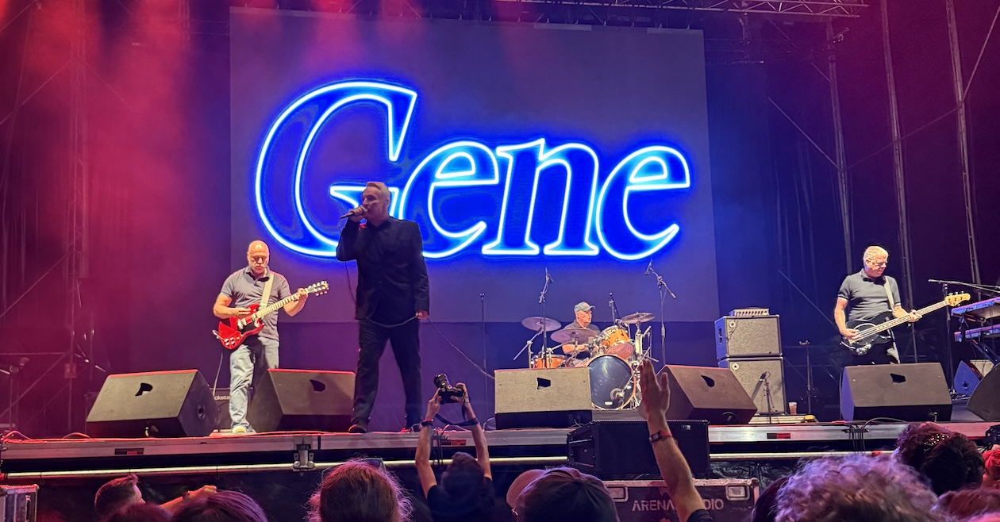

I’ve been a fan of [Gene](https://www.geneofficial.com) since the mid-nineties and have seen them live many times, always in the UK. This week I travelled to València, in the east of Spain, to [Visorfest](https://visorfest.com/en/home/), a festival for 80s/90s bands, to see them abroad for the first time.

I flew out on Thursday evening with Andy, enjoyed some local beers and tapas, followed by lunch the next day in [Colón Market](https://www.visitvalencia.com/en/what-to-do-valencia/valencian-culture/monuments-in-valencia/colon-market). The festival site was next to the beach in very warm temperatures, and sensibly timed to start at 6:30pm as the sun was setting, finishing at 2:30am. A bit late for us ageing indie fans, but much less sweaty than during the day.

Hoodoo Gurus, New Model Army and The Damned played on day one, followed by Ocean Colour Scene. 18 year old me hated OCS, and although I put that to one side, it was only when they played The Riverboat Song and that one about a train, that I begrudgingly enjoyed them.

The second night was more my cup of tea: The Wannadies, Gene, Ride, and The Manics. We were very near the front for Gene’s [set](https://www.setlist.fm/setlist/gene/2026/auditorio-marina-norte-valencia-spain-7b71b6d0.html) which included a couple of songs they’ve not played in years. They were very tight, more so than when they reformed last year, and Martin was enjoying himself, coming out at the end in a València football shirt.

I’ve uploaded a few more photos of [Gene on stage](https://grain.social/profile/did:plc:j5ksi3y4tdtbp7vpsxsfyask/gallery/3mwkxjbijcgjr). I’m now pretty knackered after three late nights in a row, but it was well worth the effort.
